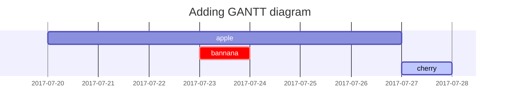

## This is a test
### This is a test for sub 

Testing footnote<sup>[1](#footnote_1)</sup>

[!img-description](/assets/img/Tired.jpeg)

{: w="500" h="300" .w-75 .normal}
_This would be the caption of the image above_

## Mermaid SVG


```shell
git add -A
git commit -m "Test"
git push
```

왜 push가 안되냐....

<a name="footnote_1">1</a>: 주석 설명
